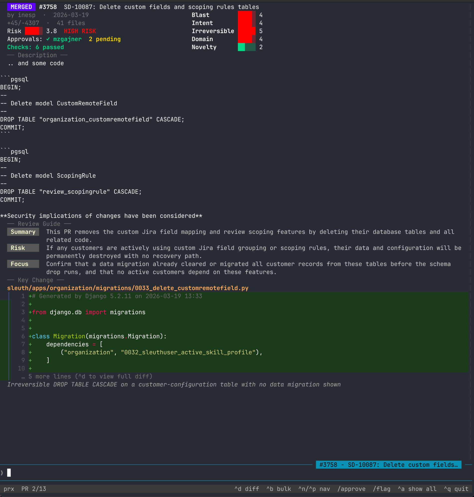
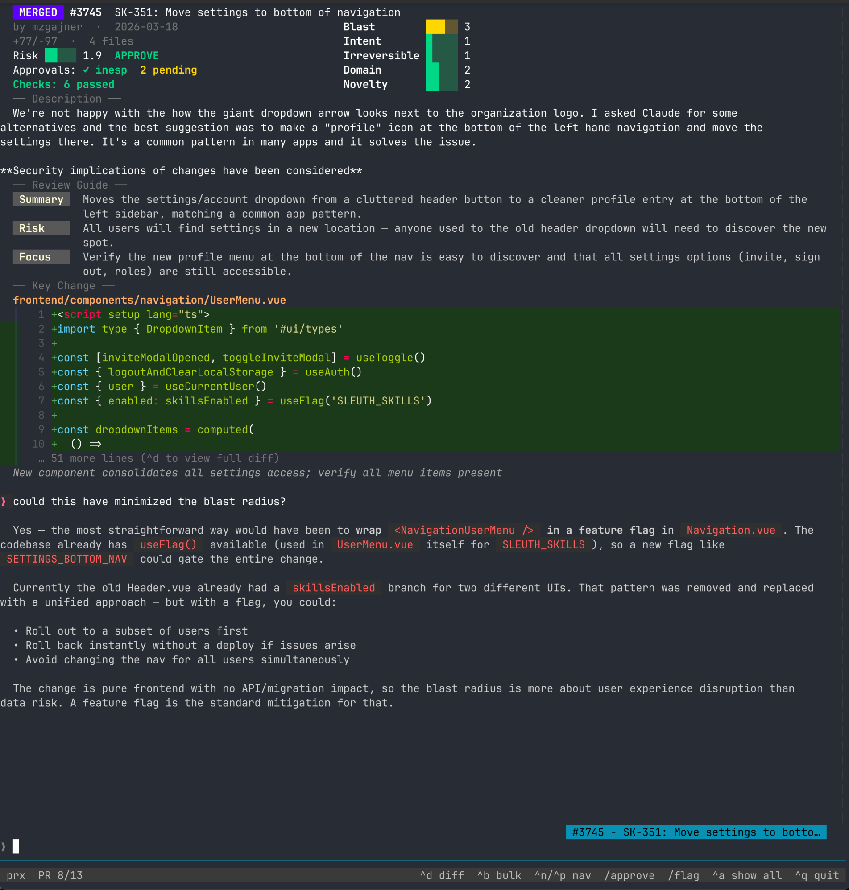
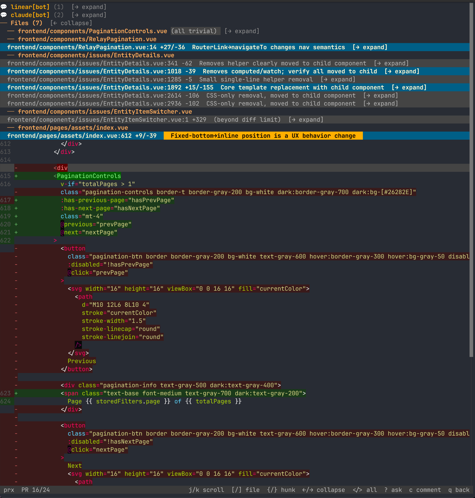
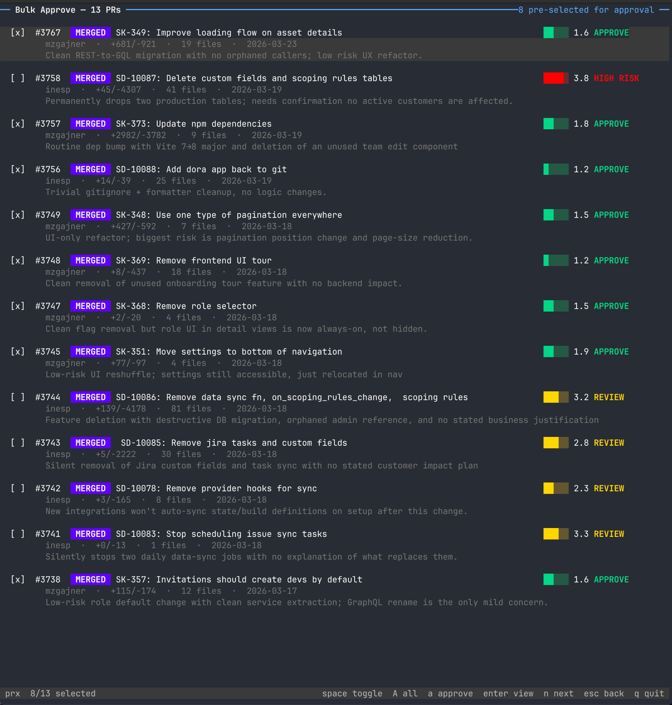
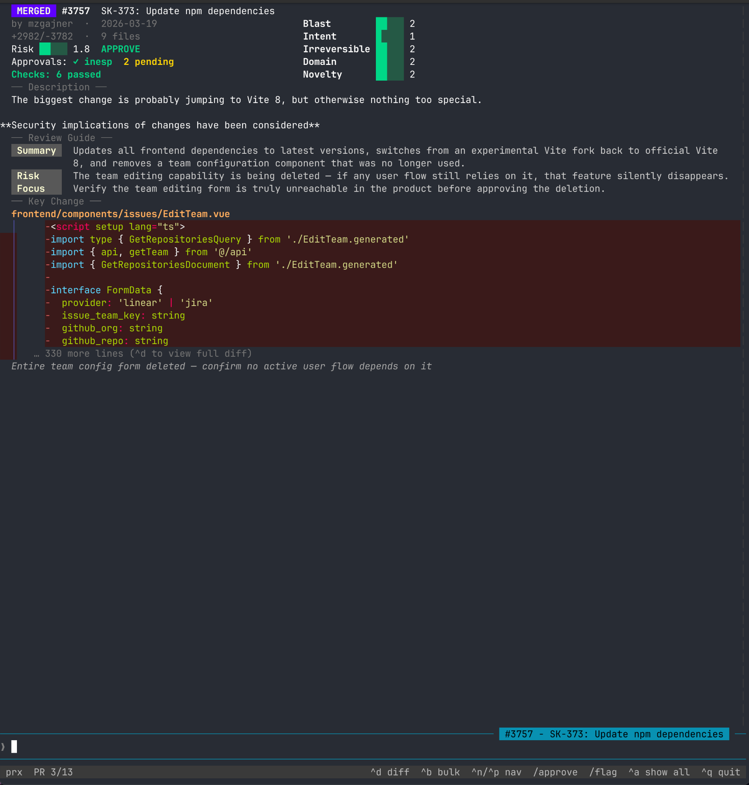

<div align="center">

# prx

### Smart code review for humans

<br>

[](https://github.com/sleuth-io/prx/releases)
[](https://github.com/sleuth-io/prx/pulls)

</div>







## What is prx?

prx is a code review terminal that helps you focus. AI scores each PR, collapses the noise, and surfaces what actually
needs your attention. Review faster and smarter, even after merge.

- **Risk scoring** - each PR is scored across configurable criteria (blast radius, intent clarity, irreversibility, domain knowledge, novelty) and given a verdict: APPROVE, REVIEW, or INVESTIGATE
- **Chat-first interface** - the primary interface is a conversation. Ask questions, take PR actions, tune scoring criteria — all through chat
- **Smart diff viewer** - full-screen diff with per-hunk risk annotations and key hunk preview. Trivial hunks auto-collapse so you see only what needs your brain
- **Bulk approve** - clear a queue of low-risk PRs in one pass before focusing on the ones that need real attention
- **Post-merge review** - catch merged PRs that landed without your approval, flag or approve with reactions

## Install

**Quick install (macOS/Linux):**

```bash
curl -fsSL https://raw.githubusercontent.com/sleuth-io/prx/main/install.sh | bash
```

Or download the latest binary from [Releases](https://github.com/sleuth-io/prx/releases).

**From source:**

```bash
git clone https://github.com/sleuth-io/prx.git
cd prx
make install
```

### Prerequisites

- [GitHub CLI](https://cli.github.com/) (`gh`) — authenticated
- [Claude Code](https://claude.ai/download) (`claude`) — for AI assessment

## Usage

```bash
# Run in the current repo
prx

# Run against a different repo
prx /path/to/repo
```

For the full reference — shortcuts, slash commands, scoring, configuration, post-merge review, custom skills, and more — see the [User Guide](internal/skills/builtins/user-guide/reference/guide.md). The guide is also available in-app: type `/user-guide` in chat or ask "how do I configure scoring?"

## License

See LICENSE file for details.

---

<details>
<summary>Development</summary>

### Building from Source

```bash
make init           # Download dependencies
make build          # Build binary
make install        # Install to ~/.local/bin
```

### Testing

```bash
make test           # Run tests
make lint           # Run linter
make prepush        # Format, lint, test, build
```

### Releases

Tag and push to trigger automated release via GoReleaser:

```bash
git tag v0.1.0
git push origin v0.1.0
```

### Demo GIF

Requires [vhs](https://github.com/charmbracelet/vhs):

```bash
make demo
```

</details>
